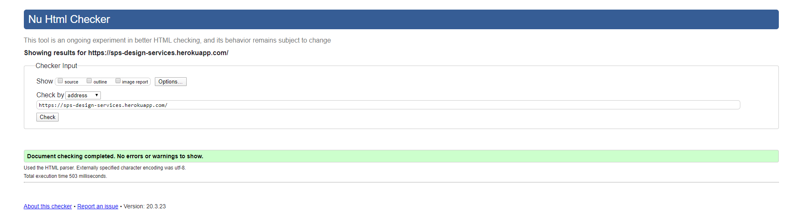
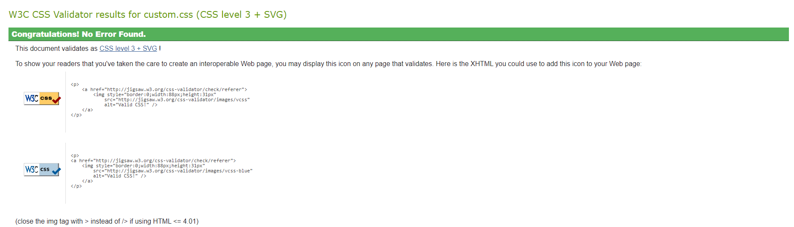
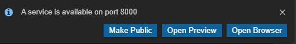

# Milestone 4 Project

## Introduction &amp; Fulfilment

This project I am combining all the knowledge I have gained from this course to build a full stack web application using th Django framework. I have been taskd with creating a platform where I can sell my freelance services. I have worked as a freelance wewb designer before the course so, I have reused some content from my own website and will model it on the same branding. This will hopefully save the amount of time I need to put in coming up with design guidelines for this course as I can follow very closely to my current style guide. My goal for this project is to produce an Django app that can be used to sell my services as a freelance designer. I need to have a form which the user will fill out to describe their needs( type, size, description, content etc), which when submitted will produce an automatic quote and then a gateway for them to pay through. I need to createthe abillity to log in to an adminarea to view all orders and upload completed work available for the customer.

[Live Heroku link here](https://sps-design-services.herokuapp.com/ "Live Heroku link here" ) 

## User Experience / UX

I have been a freelance designer for close to 10 years and I have used numerous freelancer websites to advertise my skills to hungry enthuastic clients. However alot of the companies take quite high fees and are full of hidden cost or hoops that you have to jump through to actually get your hardwork to start paying off. So I wanted to study the design that they use and how it could be redesigned in a Django framework. I'm particularly fond of the [Fiverr website](https://www.fiverr.com/ "Fiverr website" ) and took alot of design inspiration from their path of search to order with a fixed range of customisation on different plans.
So to break it down, I want to achieve:

- To build a catalog of my services and create plans that gives the client a controlled amount of customisation, which in turn will help with scope creep.
- To design and implement a user interface that you can easily navigate around without having prior experience of the site.
- The functionality to be able to see and process existing orders from the backend.
- A fully working order cart for prospective clients to exchange money for services.
- To have a portfolio of previous works on display to solidify potential customers.
- Have a user area for clients to connect with me or potentially browse their purchased services.

### User Stories

Example structure: As a < user >, I would like to < goal > so that < reason >.

- As a user, I would like to browse services, so that I can get an idea of what is offered.
- As a user, I would like to fill in a contact form, so that I can get some extra advice.
- As an admin user, I would like to add a service, so that I can market my new skill.
- As an admin user, I would like to edit a service description, so that I can add / remove included features.
- As a potential customer, I would like to browse the portfolio, so that I can feel more at ease my demands can be met.
- As a potential customer I want to have flexibility on what I am getting for my money and further customization if I need it.
- As a registered account holder, I want to have the ability to have alerts when I perform an action to let me know that the action has been performed successfully or not.
- As a registered account holder, I want to be able to purchase a service using a simple payment form, in as least steps as possible.

### Design

The design for this project is based mainly on my existing branding for my freelance business but with a couple of subtle changes. I have run with a simple and clear user interface to maximize attention to certain areas like service images and buttons. This hopefully will stop the user from getting too distracted when running through the order process but will keep a smooth and professional air about the web application. I have done my best to minimize the size of the graphics and scripts on the site( without losing quality or functionality), in order to make my site quick and responsive to aid in a happy user experience.

#### Typography

I have limited myself down to two fonts, which contrast a reasonable amount in order to better distinguish heading from paragraph.
'Montserrat' is my heading font, I love this font for its bold striking characters which set it apart from anything else on the page.
'Roboto Mono' is the font I have used for the main body of my text. I feel this quirky monospace font captures the fun vibe without losing the professional edge, perfect for adding a bit of charm and character to the site, which helps to distance it from others in its genre. Both fonts I have aquired from [Google Fonts](https://fonts.google.com/ "Google Fonts" ), I chose Google fonts, because its FREE for a start and it houses a wide selection of fonts with easy implementation with no strings attached, perfect.

#### Colour Scheme

I'm a big fan of teal and punchy colours, so as you can see it may have have influenced my project a "tad". I have worked from aspect of keeping things fairly neutral but using my colour palette to highlight areas and accentuate call to action buttons to attract potential clients attention. Just incase you can't see the photo below, the colours in question are as follows:
#1B1332 --> MIDDLE RED PURPLE #008082 --> TEAL #E5097F --> MEXICAN PINK #333333 --> JET BLACK #393082 --> COSMIC COBALT

#### Icons

I have imported and used icons from the [Font Awesome](https://fontawesome.com/v4.7.0/icons/ "Font Awesome" ) library, its not my favourite library out there but it is very quick and easy to implement and get started with. However I did find that some html entities were better for alignment rather than using icons. This was definately the case with currency symbols I found.

#### Frameworks

- Django 1.11.28 - I decided not to convert to version 2 as I learnt with this version originally. However after undertaking this project I did realise that I had made my life a bit harder as their is less support and live examples of this version of the framework due to its age. I do hope to learn 2 or maybe even the latest version at some point. But for the point of this project, I feel it met my requirements.

- Bootstrap 3.3.7 - I have used Bootstrap heavily over the last two years and have favoured it over many overs. However I picked this particular version because it doesn't use preprocessors as heavily as the newer versions. Not that I can't use them, but I feel that add an uneccessary layer of complexity in your code. Especially when dealing with a complex coding language like Django. I really like the simplicity of Bootstrap and the flexibility of the classes and grid system, it helps to make my life alot easier without being too controlling over elements and components.

- JQuery 3.2.1 - As I used Bootstrap as my CSS framework, I needeed JQuery to run some of the functionality. So I used it mainly to prop up and support the Bootstrap framework. That being said, it is a very nifty framework, which if I hadn't used alot of the built in features from Django I could have easily done similar functions using JQuery or atleast broadened my projects functionality anyway.

### Wireframing

I used [Balsamic](https://balsamiq.com/ "Balsamic" ) for my projects wireframes. Not the most user friendly or the best for graphical works of art, but you can pick it up pretty fast and there is a wide range of icons and components. Which allows you to drag and drop a fairly accurate and clear wireframe in record time. My design didn't stray to far away from my initial wireframes as I felt after doing the wireframes I had a pretty good idea of what I wanted to achieve. I also really like how it opens your eyes to what space you need for certain design aspects to work and to work together. I did change my mind on some of the icons that I used and in what order. This happened when I realised the icons I was using for certain positions actually fit other elements better. I also used the Google search engine to search for key words or phrases and noted what results came up first in terms of imagery and related phrases. I think this helped alot to get out of my own head and think about what other people might be looking for or what they might associate with a certain term. Please see below the pictures of my first initial mock up wireframes.

### Flow Chart

This is the flowchart I used to plan my database structure. This differed from the original as I decided to move the foreign keys around for better future proofing for real world usage.

## Technology Used

- Gitpod - Used as my Sole IDE for writing code.
- GitHub - Used as my sole repository hosting service and version control.
- Adobe Photoshop CS5.5 - I used Photoshop to resize and optimize my images for the web.
- Kraken.io - Kraken is an image optimizer which helps to compress my images before uploading them to the web.
- Coolors.co - Coolors is a fantastic web application that helps to pick a nice palette of web colours. I used this to refine my shades of colour and export the palette as a image file for supporting project files.
- Corel Draw X8 - Corel was used heavily to create custom images and icons displayed around the site. I also usd it for roughly sketching ideas for content when not using Balsamic.
- Travis - I used Travis to check my repo for errors and mistakes I may have missed.
- Google Fonts - I ised Google Fonts to import and supply my web application with web safe fonts.

### Front-End Technologies

- HTML - Used as the base for project code.
- CSS and Bootstrap - Used for customisation of my html elements without any preprocessors.
- JS and JQuery - Used to extend the functionality of my projects code.
- Light Gallery.js - I used the Light Gallery library as the base of my customised portfolio slider gallery, it uses a couple of other Javascript librarys to extend its functionality like creating a full screen version of the image, zooming in and out and other handy functions like a slideshow timer( if you wanted the user to determine whether they control or have images scroll through automatically on a timer).
- emailjs - I used Emailjs as the method to manage my data submissions sent from my contact form to my delivery location address.

### Back-End Technologies

#### Django 1.11.28

- dj-database-url - 0.5.0 - A core file I needed to use database urls in my Django application.
- django-forms-bootstrap - 3.1.0 - This allowed me to inject Bootstrap classes into forms auto generated from Django from my Python views and forms files.
- django-storages - 1.9.1 - Used to provide custom storage backends in my Django project.
- stripe - 2.43.0 - This is a Python library to provide my repo with access to Stripe API, which is what I used as my sole payment gateway for my order cart.

#### Python 3.7.6

- boto3 - 1.12.16 / botocore - 1.15.16 - Used to allow me to use Amazon Web Services( AWS) Software Development Kit, which in turn readied my project to be able to use the AWS servers for remote storage of static files.
- gunicorn - 20.0.4 - Used as a Web Server Gateway Interface(WSGI), which allowed me to get my Python Application to talk to Heroku.
- Pillow - 7.0.0 - Is a Python Imaging Library, which allowed me to open, manipulate and saving image files in my static files directory.
- psycopg2 - 2.8.4 - Is a PostgreSQL database plugin for supporting use of PostgreSQL databases.
- s3transfer - 0.3.3 - Is a Python library for enabling me to manage Amazon S3 transfers between my repo and the AWS.
- Jinja - I used this to write code to retrieve and manipulate stored date from the server.

## Features

### Implemented Features

The site currently has the following features:

- To register an account connected to an email or username.
- To send a password reminder to a registered user.
- To login and logout an existing user with an alert letting them know they have done so.
- To browse different available services.
- Services with nicely presented tabs to cycle through the different plans in that category.

#### Future Features

- I would like to add the feature which I featured on the user profile page, which is the ability to see active subscriptions to services the user has paid for and a expiry date for repeat billing. I added a coming soon page filler to gauge an idea of the space if I ever get the time to launch this app into the real world. 
- I also like the idea of adding the abillity of adding a user profile photo and having a thumbnail that would act as a default if they didn't open load one. In a similar way a social media platform has one.

## Testing

**Add Functionality** - I have tested forms throughly on the front-end. I did this by initially trying to get the form to send without filling any data in and checking that it flags that the required criteria is not met. I then began a series of tests by putting data in the first input field and trying to send, checking that it still flags the required criteria and then continue to do this with all the fields until all the requirements have been met. I also double-checked that the form sends when all required criteria has been submitted and that the data from the form is being sent correctly to its destination. An example of where I have done this specifically is the contact form on the contact.html page. I used [Emailjs](https://www.emailjs.com/ "Emailjs" ) javascript library to manage my submissions and I used custom javascript to link it to my project. I sent multiple tests to my personal gmail account to makesure that it was sending properly. 

**Edit Functionality** - Once you have logged into the admin area, there is the option to edit services( if you have the correct user role privileges, if not it will simply refuse the user entry), I have tested this by adjusting the values in each input box provided and checking the front end for the corresponding content change. Due to correct coding for the models this did not incur any errors whilst testing. But I did add a blank box on some of the input fields, which added flexibility when aservice did not require that field to be displayed without having the statement "None" being presented on services without the field defined.

**Delete Functionality** - I tested the delte function much like the *edit* function, as I would also need to navigate to the admin area and select to edit a serivce or available model. However when I tried this originally I did discover the way foreign keys operate under certain "collapse" attributes, as when I deleted a service category originally, it would delete all the product assigned to it. Which was a huge design flaw, I then developed my database structure further using flowcharts. This resulted in me changing the foreign keys to be in the service model and linking from there to the other two models.

### Validators

I ran the following linters to validate my code and make it squeaky clean!

**Html** - I used the Nu Html Checker to validate my code and open my eyes to any issues that I may have missed. Originally it flagged two errors, one script tag where I accidentally had specified a "type" which was not needed and the other was nesting divs inside an unordered list, not sure why I did that. I reckon I must have been tired, ha!

**CSS** - I used the W3C CSS Validator to validate my CSS, I had two errors originally which was an invalid "speak" value and a depreciated term in my bootstrap.css file (max-device-width)which I updated and checked to makesure it was still working.

**JS** - I used JSHint to validate my javascript code and it only flagged a couple of undefined function errors, however this is because it relates to a stylesheet from the Emailjs site which I do not have access to.

**Python** - I installed [autopep8](https://pypi.org/project/autopep8 "autopep8" )  to tidy up my unruly code and make it more readable. I favoured this over my old technique of using an online linter as it is much quicker and more efficient.

**Markdown** - I used a fantastic markdown extension in VScode to validate my README.md file called  [markdownlint](https://marketplace.visualstudio.com/items?itemName=DavidAnson.vscode-markdownlint "markdownlint" )... I know creative right! Well what it lacking in creativity, it made up for in function and it simply just highlighted the errors with links for documentation for the correct syntax. Perfect.

### Compatibility

I ran my deployed app on Heroku through a site called [lambdatest](https://lambdatest.com/ "lambdatest" ), which tested my app extensively through a number of browsers and responsive tests that madesure it worked well across the board. 

## Deployment

### Local Deployment

I deployed my project using Gitpod IDE and Github, so I will demonstrate how to deploy locally using the same method. If you are using a local code editor like VScode please check you have all the prerequisites for version control, Python and the correct version of Django installed. Please also refer to my requirements.txt file if you need to check any dependents prior to pulling the repo from Github. Please also change the name if you are forking, as this is used actively on my personal and freelance development career. Thank you!
Please follow the following steps carefully:

1. Gitpod setup - Firstly, create a Gitpod account if you haven't already and agree to the neccessary terms to create your free account. You will need to authorize a connection between Gitpod and your Github account. Proceed to then add the [Gitpod](https://chrome.google.com/webstore/detail/Gitpod-online-ide/dodmmooeoklaejobgleioelladacbeki "Gitpod" ) extension to your Chrome Browser( for the record I have not tried using this extension on another brand of internet browser, so I would highly recommend using Chrome whilst using Gitpod).

2. Create project in Github - Firstly scroll up to the top of this page and you will see a button called "Fork", this will alow you to copy the projects files on to your own repo on your account .*Please Note: you could press the Gitpod button to deploy this project straight from my repo, however it is better practice to create your own repo on your account first as this future proofs further development and version control on your cloned project*. Once you have set up your own forked version of the project scroll again to the top of the page and click on the green "Gitpod" button to open your repo in Gitpod for the first time. 

3. Setting up the environment variables - Now you have the project open in Gitpod, you need to start configuring your enviroment variables. This project is setup to use a file called "env.py" to store all the projects environment variables, including Djangos SECRET KEY. You will need to create one for Django and create a Stripe account to generate your unique PUBLISHABLE and STRIPE_SECRET key. So go ahead and create a file called "env.py" in your home directory, and then add your keys using the following syntax adding your own unique key in the gaps.

~~~
import os
os.environ.setdefault('STRIPE_PUBLISHABLE', "[YOUR KEY HERE]")
os.environ.setdefault('STRIPE_SECRET', "[YOUR KEY HERE]")
os.environ.setdefault('SECRET_KEY', "[YOUR KEY HERE]")

~~~

4. Adding and installing project dependents - There is a file named "requirements.txt" which contains a list of all the projects dependent libraries. You will need to install this before the project will work properly. To do this simply open a new terminal in Gitpod and type in the command ~~~ pip3 install -r requirements.txt ~~~

5. Booting a local development server - To view your project on a live local development server, you need to tell python to first serve a port. To do this you need to type the command ~~~ python3 manage.py runserver ~~~ into the terminal and press enter. You should then be greated with a little message that says "A service is available on port 8000" in the bottom corner of the screen. Click either "Open Preview", to open the Gitpod preview pane inside the IDE or press "Open Browser". Which will open the running development server in a new tab. Voila, you are set up and ready to go!

### Remote Deployment

These are the steps I took to deploy my project to Heroku using Heroku's "Hobby Dev" free PostgresSQL database.

1. Create app in Heroku - First things first, I need to create a new app in my Heroku account. This is where my project will eventually be hosted on. Once I have created my app I need to navigate to the "Resources" tab. When my project is deployed it is going to need a database, so scroll down the page and start typing in "Postgres", you should now see "Heroku Postgres" in the dropdown. Click it and select the plan name "Hobby Dev - Free", this will be the new database when deployed. Navigate now to the settings tab and click "Reveal Config Vars", this should reveal an input box with your PostgreSQL database url in it. Copy the details and update the "env.py" file. Also this is a good time to copy your other secret keys from "env.py" and stick them in the boxes, using the same format as the database_url. This needs to be done as the "env.py" file does not get deployed to Heroku( as its in my .gitignore file).

2. Linking the project to the PostgreSQL database - Now I need to navigate back to my project files in Gitpod and update my seetings.py file. At the top underneath "import os" I need to insert the line...

~~~bash
import dj_database_url
~~~

Next I need to tell my project that this is the database I want to connect to.*Before doing this it is a good idea to either note down any bulk content from the current database or take a backup of the files. As once you switch databases it will remove anything you have added via the admin panel!* So I scroll to the database section of my settings.py file, comment out the current database setup and insert the following:

~~~bash
DATABASES = {
    'default': dj_database_url.parse(os.environ.get('DATABASE_URL'))
 }
~~~

This will search my env.py for my database_url I inputted earlier from Heroku and connect to the new database.

3. Installing requirements - First I need to check that I have the following libraries installed, in order for my repository to correctly communicate with Heroku and work as expected.
    - Gunicorn or "Green Unicorn" - Gunicorn is a Python WSGI( Web Server Gateway Interface).

    ~~~bash
    pip3 install gunicorn
    ~~~

    - psycopg2 - A database adapter for PostgreSQL for Python.

    ~~~bash 
    pip3 install psycopg2
    ~~~

    - whitenoise - This allows for the proper use of the static files, such as CSS, JS, images etc. This needs the following line added to the settings.py to function in the project.

    ~~~bash
    'whitenoise.middleware.WhiteNoiseMiddleware',
    ~~~

    You will also need to add the following line to the bottom of the settings.py page to tell whitenoise, where the static directory is:

    ~~~bash
    STATIC_ROOT = os.path.join(BASE_DIR, 'staticfiles')
    ~~~

    Again I can install this using the following terminal command

    ~~~bash
    pip3 install whitenoise
    ~~~

Don't forget to add these new dependents to your "requirements.txt". You can do this with the following command:

~~~bash
pip3 freeze > requirements.txt
~~~

Last thing I need to do in the settings.py file is add my Heroku app name to the Allowed host setting, if this is not done correctly Heroku will give a forbidden error when trying to access the web app.

4. Creating a Procfile - A Procfile is the file that tells Heroku what programming language you are using and gives it more insight into what buildpack it should use. *Please Note: You must use a capital "P" in the file!*. Create this in the home directory.

5. Deploying to Heroku - Next its almost time for me to deploy, I now have all the requirements in place. Back on Heroku in my app view, I navigate to the deploy tab and scroll down to the deployment method options. For this project I am going to use the middle button "Connect to Github", this will ask for you to login and and authorize the connection. Once this is done I search for my project repository by starting to type it into the search box and click connect. My next step is to scroll down to "Manual Deploy" and click on "Deploy Branch" this will then start the deployment process to Heroku!

6. Amazon S3 bucket - Its important to point out at this point that even though my web app is deployed successfully, I need to setup an external service for the saving of static files. Why? This is because Heroku uses a system for saving files that only last in 12 hour cycles after that it deletes all static content. Which is far from ideal. So I want to set up an AWS( Amazon Web Services) account so I can create and use "Buckets" to store my static files in to ease my mind that all my content is going to be deleted.*Its always good practice to have a database backup, but I'm not going to demonstrate that in this project*.
Once I have setup an account I need to navigate to the Amazon S3 service and click the orange button "Create Bucket". Flick to the Properties Tab and click "Static website Hosting". In here I need to define some example html pages. Insert "index.html" and "error.html" as the example states and click save. Make sure your properties are set to public so its possible to for my admin user to upload static files via the admin panel.

    - Bucket configuration - Moving on, I need to configure my Bucket Policy, to do this I need to fill in the following default code into the empty box and press save( in the live version I have changed my ARN into the one displayed inside the dashboard)...

~~~bash
{
    "Version": "2012-10-17",
    "Statement": [
        {
            "Sid": "PublicReadGetObject",
            "Effect": "Allow",
            "Principal": "*",
            "Action": "s3:GetObject",
            "Resource": "arn:aws:s3:::example-bucket/*"
        }
    ]
}
~~~

In CORS config I also need to input the following code...

~~~bash
<?xml version="1.0" encoding="UTF-8"?>
<CORSConfiguration xmlns="http://s3.amazonaws.com/doc/2006-03-01/">
<CORSRule>
    <AllowedOrigin>*</AllowedOrigin>
    <AllowedMethod>GET</AllowedMethod>
    <MaxAgeSeconds>3000</MaxAgeSeconds>
    <AllowedHeader>Authorization</AllowedHeader>
</CORSRule>
</CORSConfiguration>
~~~

- Identity and Access Management (IAM) - This is where I define who can access my Amazon AWS services. Firstly I need to set a group name, I have given it the name "sps-design-group" as my bucket to keep things simple. Once I have created a group I have to create a policy. Click "Create policy", navigate to the JSON tab, click "import managed policy" and select Amazon S3-full Access. In the resource line of code remove the asterix string and replace with a list consisting of two items, first item is the ARN from the bucket policy and the second is the same again but with a "/*" appended to the end. Click "Review Policy", and then I have given the policy a name that is associated with the bucket. For simplicity sake, I have named it "sps-design-policy". Next step is to add it to the group I created earlier. Lastly I need to create a user for the group, tick programatic access, and add to group I previously created. This will then give you the option to download the "credentials.csv", this file is amazingly important as this is only generated once. If you don't log them you would have to delete your user and start again.

7. Adding AWS S3 to Django -  There is a couple of packages needed in order to use the S3 in my project. one is called "Django Storages" and the other is called "boto3". These will need to be installed and added to the requirements.txt file in the same way as documented above. As the same way apps have been declared previous in this project, "Django Storages" will need to be declared under INSTALLED_APPS. Following this I need to add a parameter to the bottom of my code so it lets AWS know it can cache my static files. See example code below...

~~~bash
AWS_S3_OBJECT_PARAMETERS = {
    'Expires': 'Thu, 31 Dec 2099 20:00:00 GMT',
    'CacheControl': 'max-age=94608000'
}
~~~

I then need to add the details of the AWS Bucket that I am trying to connect to for my static files.

~~~bash
AWS_STORAGE_BUCKET_NAME = 'sps-design-services'
AWS_S3_REGION_NAME = 'eu-west-2'
AWS_ACCESS_KEY_ID = os.environ.get("AWS_SECRET_KEY_ID")
AWS_SECRET_ACCESS_KEY = os.environ.get("AWS_SECRET_ACCESS_KEY")

AWS_S3_CUSTOM_DOMAIN = '%s.s3.amazonaws.com' % AWS_STORAGE_BUCKET_NAME
~~~

- Adding AWS credentials - The code above is asking for the AWS variables in the "env.py" file. At the moment we haven't actually put them in there, so I need to open the "credentials.csv" file I downloaded earlier and copy and paste in my variables. As we have deployed this project to Heroku, I also need to add these key variables to heroku the same way as I did the others. To check its wired up correctly, I have ran the command in the terminal window...

    ~~~bash
    python3 manage.py collectstatic
    ~~~

Now this is uploading all the current static files to the S3 bucket. To check whether the project is pulling the static files from the bucket. I can run the server and open developer tools, if I inspect any element that I have styled on the page and click the link( for example "custom.css"), it should show me the link to the file goes to my S3 Bucket, Success!

## Special Thanks & Inspiration

### Inspiration

I took my inspiration for my initial design layout for service tabs from [Fiverr website](https://www.fiverr.com/ "Fiverr website" ), however I do feel now I have had the time to tweak them, that my design is marginally better.

### Special Thanks

I would like to thank my peers in Slack for giving me guidance and helping me to solve some of the more advanced features and get over some difficult hurdles. I would also like to give a big thank you to the CI support team as their help has got me out of some pretty tough spots too, and they are seem to be a pretty great bunch! Lastly but not leastly an enormous thank you to my girlfriend for not killing me whilst I grump around the house frustrated that my code wont work or the long days and nights spent at my desk coding away!
