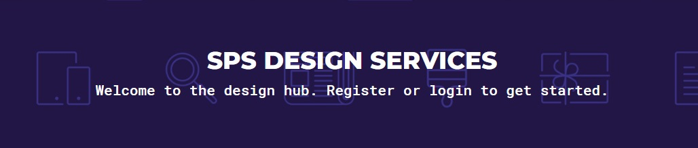
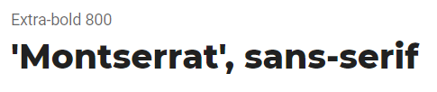
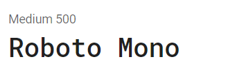
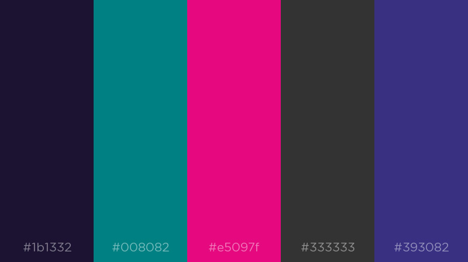
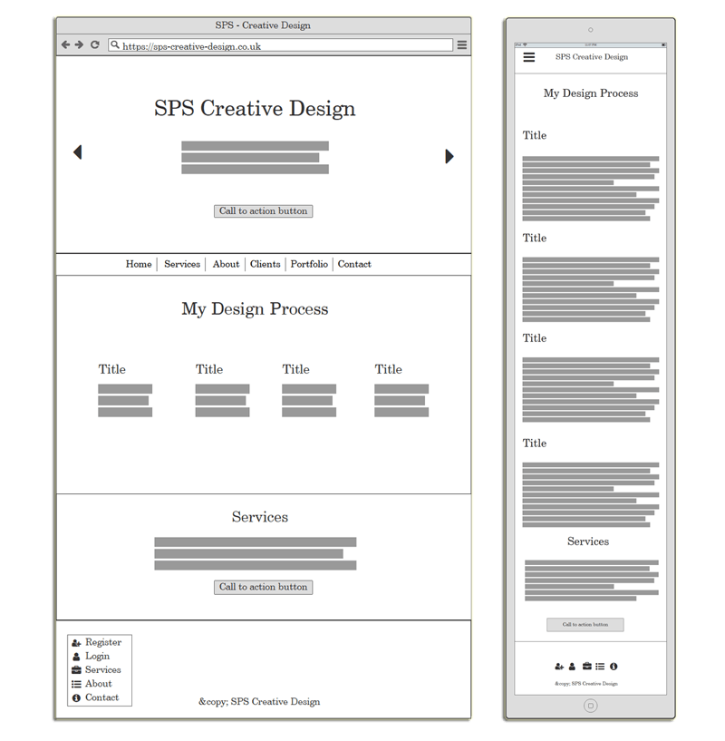

# Milestone 4 Project

## Introduction &amp; Fulfilment
This project I am combining all the knowledge I have gained from this course to build a full stack web application using th Django framework. I have been taskd with creating a platform where I can sell my freelance services. I have worked as a freelance wewb designer before the course so, I have reused some content from my own website and will model it on the same branding. This will hopefully save the amount of time I need to put in coming up with design guidelines for this course as I can follow very closely to my current style guide. My goal for this project is to produce an Django app that can be used to sell my services as a freelance designer. I need to have a form which the user will fill out to describe their needs( type, size, description, content etc), which when submitted will produce an automatic quote and then a gateway for them to pay through. I need to createthe abillity to log in to an adminarea to view all orders and upload completed work available for the customer.

[Live Heroku link here](#/ "Live Heroku link here" )

### SPS Creative Services

## User Experience / UX
I have been a freelance designer for close to 10 years and I have used numerous freelancer websites to advertise my skills to hungry enthuastic clients. However alot of the companies take quite high fees and are full of hidden cost or hoops that you have to jump through to actually get your hardwork to start paying off. So I wanted to study the design that they use and how it could be redesigned in a Django framework. I'm particularly fond of the [Fiverr website](https://www.fiverr.com/ "Fiverr website" ) and took alot of design inspiration from their path of search to order with a fixed range of customization on different plans.
So to break it down, I want to achieve:
- To build a catalog of my services and create plans that gives the client a controlled amount of customization, which in turn will help with scope creep.
- To design and implement a user interface that you can easily navigate around without having prior experience of the site.
- The functionality to be able to see and process existing orders from the backend.
- A fully working order cart for prospective clients to exchange money for services.
- To have a portfolio of previous works on display to solidify potential customers.
- Have a user area for clients to connect with me or potentially browse their purchased services. 

### User Stories

Example structure: As a < user >, I would like to < goal > so that < reason >.

### Design
The design for this project is based mainly on my existing branding for my freelance business but with a couple of subtle changes. I have run with a simple and clear user interface to maximize attention to certain areas like service images and buttons. This hopefully will stop the user from getting too distracted when running through the order process but will keep a smooth and professional air about the web application. I have done my best to minimize the size of the graphics and scripts on the site( without losing quality or functionality), in order to make my site quick and responsive to aid in a happy user experience.

#### Typography
I have limited myself down to two fonts, which contrast a reasonable amount in order to better distinguish heading from paragraph.
'Montserrat' is my heading font, I love this font for its bold striking characters which set it apart from anything else on the page.
'Roboto Mono' is the font I have used for the main body of my text. I feel this quirky monospace font captures the fun vibe without losing the professional edge, perfect for adding a bit of charm and character to the site, which helps to distance it from others in its genre. Both fonts I have aquired from [Google Fonts](https://fonts.google.com/ "Google Fonts" ), I chose Google fonts, because its FREE for a start and it houses a wide selection of fonts with easy implementation with no strings attached, perfect. 

#### Colour Scheme
I'm a big fan of teal and punchy colours, so as you can see it may have have influenced my project a "tad". I have worked from aspect of keeping things fairly neutral but using my colour palette to highlight areas and accentuate call to action buttons to attract potential clients attention. Just incase you can't see the photo below, the colours in question are as follows:
#1B1332 --> MIDDLE RED PURPLE #008082 --> TEAL #E5097F --> MEXICAN PINK #333333 --> JET BLACK #393082 --> COSMIC COBALT

#### Icons
I have imported and used icons from the [Font Awesome](https://fontawesome.com/v4.7.0/icons/ "Font Awesome" ) library, its not my favourite library out there but it is very quick and easy to implement and get started with. However I did find that some html entities were better for alignment rather than using icons. This was definately the case with currency symbols I found.

#### Frameworks
- Django 1.11.28 - I decided not to convert to version 2 as I learnt with this version originally. However after undertaking this project I did realise that I had made my life a bit harder as their is less support and live examples of this version of the framework due to its age. I do hope to learn 2 or maybe even the latest version at some point. But for the point of this project, I feel it met my requirements.

- Bootstrap 3.3.7 - I have used Bootstrap heavily over the last two years and have favoured it over many overs. However I picked this particular version because it doesn't use preprocessors as heavily as the newer versions. Not that I can't use them, but I feel that add an uneccessary layer of complexity in your code. Especially when dealing with a complex coding language like Django. I really like the simplicity of Bootstrap and the flexibility of the classes and grid system, it helps to make my life alot easier without being too controlling over elements and components.

- JQuery 3.2.1 - As I used Bootstrap as my CSS framework, I needeed JQuery to run some of the functionality. So I used it mainly to prop up and support the Bootstrap framework. That being said, it is a very nifty framework, which if I hadn't used alot of the built in features from Django I could have easily done similar functions using JQuery or atleast broadened my projects functionality anyway.

- 

### Wireframing
I used [Balsamic](https://balsamiq.com/ "Balsamic ) for my projects wireframes. Not the most user friendly or the best for graphical works of art, but you can pick it up pretty fast and there is a wide range of icons and components. Which allows you to drag and drop a fairly accurate and clear wireframe in record time. My design didn't stray to far away from my initial wireframes as I felt after doing the wireframes I had a pretty good idea of what I wanted to achieve. I also really like how it opens your eyes to what space you need for certain design aspects to work and to work together. I did change my mind on some of the icons that I used and in what order. This happened when I realised the icons I was using for certain positions actually fit other elements better. I also used the Google search engine to search for key words or phrases and noted what results came up first in terms of imagery and related phrases. I think this helped alot to get out of my own head and think about what other people might be looking for or what they might associate with a certain term. Please see below the pictures of my first initial mock up wireframes.

## Technology Used

### Front-End Technologies

### Back-End Technologies

## Features

### Implemented Features

#### Future Features

## Testing

### Validators

#### Compatibility

#### Found Bugs and Fixes

## Deployment

**Remote Deployment**

## Copyrights

### Media

### Content

### Special Thanks & Inspiration

#### Inspiration

#### Special Thanks

